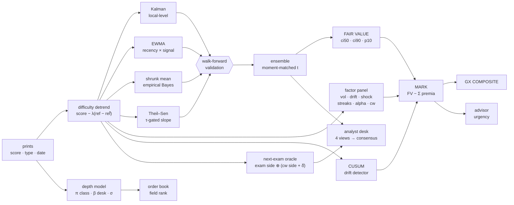
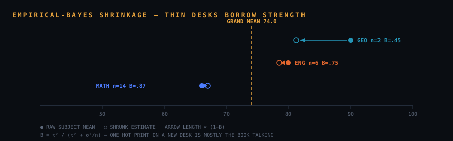
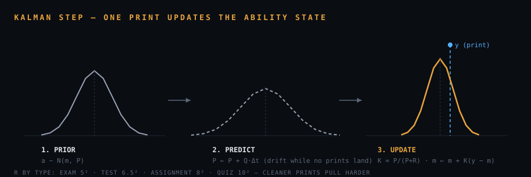
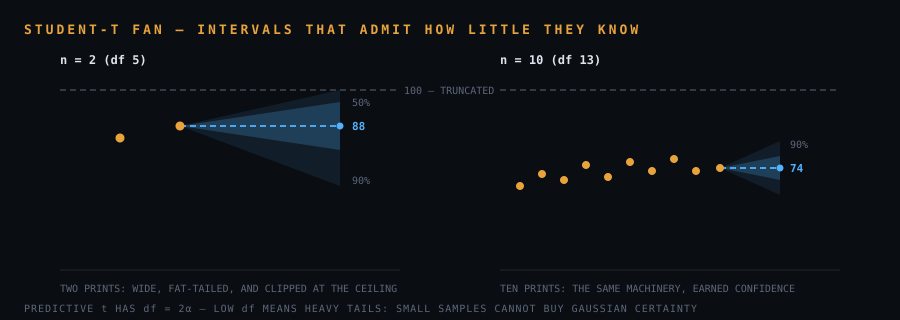

# GRADANTIR

*also known as Grade Exchange. The product name is Gradantir; the code, the store key,
and the export format still say `grade-exchange`, and stay that way for now.*

**A risk-adjusted pricing engine for academic performance under severe small-sample constraints.**

A student's transcript is a sparse, heteroscedastic, non-stationary time series with a
hard boundary at both ends and no guarantee of a trend. Report cards summarize it with
an arithmetic mean, which is the one statistic that discards everything decision-relevant:
whether the student is drifting, whether they are erratic, whether their edge over the
cohort is closing, and whether the low-stakes work predicts the high-stakes work.

This engine estimates two distinct quantities and refuses to conflate them:

| | question | answer |
|---|---|---|
| **Fair value** (FV) | *What is this subject probably worth?* | A Bayesian capability estimate over every print, with Student-t credible intervals. |
| **The MARK** | *What would a risk-averse market pay for it today?* | Fair value minus an itemized, attributable risk discount. |

The gap between them is the object of interest. Fair value is an unbiased estimator and
is used for every forecast. The mark is deliberately, defensibly **biased downward** in
proportion to the pathologies present in the tape — drift, instability, shock,
coursework divergence, alpha erosion — and is what the interface displays as the price.
A subject that oscillates between 52 and 85 and a subject that prints 68 every time have
the same mean; they do not have the same mark.

The presentation layer is a trading terminal because the metaphor is load-bearing, not
decorative: a price falls when the position deteriorates, the deepest discounts mark
where effort has the highest return, and the discount is always decomposed into the
charges that produced it. Static single-page app, no backend, `localStorage` only.

---

## 1 · The estimation problem

Grade data violates nearly every assumption that standard forecasting machinery relies on:

| property of the data | what breaks |
|---|---|
| $n \approx 5\text{–}12$ prints per subject | asymptotics; least-squares extrapolation; any CLT appeal |
| heterogeneous instruments (exam / test / assignment / quiz) | i.i.d. observation noise |
| irregular spacing — 3-day gaps and 200-day breaks | discrete-time state-space models |
| bounded support $[0,100]$ with ceiling effects | symmetric predictive intervals of any family |
| difficulty varies between sittings | comparability of raw scores |
| a single catastrophic print is common and uninformative | mean- and OLS-based estimators |

Four design constraints follow, and every component below is answerable to them:

1. **Produce an honest estimate from $n = 1$.** No component may be undefined at small $n$;
   it must degrade to a defensible prior instead.
2. **Never hallucinate a trend from noise.** A slope must pass a significance gate before it
   may forecast, and is damped by how weakly it passed. This is a *bound* on how much noise
   can become trend, not a guarantee that none does — see §5, which states the limit
   precisely rather than overclaiming it.
3. **Uncertainty must widen when data is thin,** not silently vanish. Student-t throughout,
   never Gaussian. (Student-t is an answer to *thin data*, not to the $[0,100]$ boundary —
   §23 is explicit about what the intervals do at the ceiling.)
4. **No single print may hijack the line.** Medians, MAD, winsorizing — not means.

A fifth constraint governs Part II specifically: **every point of discount must be
attributable.** A risk model that outputs a scalar "quality score" is unfalsifiable and
unactionable. Each charge names its factor, its magnitude in points, and its evidence.



The factor panel and the CUSUM hang off the **detrended** tape, not the raw prints, and both
run their own walk-forward pass rather than reading the ensemble's — they answer different
questions and must not inherit its weights.

### Notation

Subject $s$ has prints $y_1,\dots,y_n$ (scores, 0–100) at calendar days $x_1 \le \dots \le x_n$,
each of type $c_i \in \{\text{Exam},\text{Test},\text{Assignment},\text{Quiz}\}$, optionally
carrying a class average $a_i$, year-level average $g_i$, and placement $(r_i, N_i)$.
"Today" is $x_\ast$. Detrended scores are $\tilde y_i$.

---

# Part I · Fair value — the measurement model

## 1b · The school calendar — two clocks, and the settlement lag

Every figure in this document is bucketed by *term*, so being wrong about terms is being
wrong about everything downstream. A school year is not four calendar quarters: terms open
and close on dates the school publishes, those dates drift by a week or two each year, and —
the part that breaks every naive implementation — **results arrive after the term they
measure**. A Term 1 paper sat in late March is handed back in the April holidays one year and
two days into Term 2 the next; the mid-year paper is marked over the July break and published
a fortnight into Term 3. Bucketing by "which term is this date in" files the same round under
a different term every year.

So the calendar keeps two clocks:

| clock | question | used by |
|---|---|---|
| **teaching term** | where is the school physically today? | session chrome, week numbers, holiday-aware ageing |
| **reporting term** | which term does this result report *on*? | every bucket, tape, index and average |

The reporting grid is the teaching grid shifted forward by a **settlement lag** $L$ (default
28 days), anchored to the *next* term's opening rather than the previous term's close so the
seven-week summer cannot swallow a December round into February:

$$
\text{term}(d) \;=\; \max\{\,T : \text{start}(T) + L \le d \,\}
$$

On the reference book this files all three April rounds as T1 and both August rounds as T2,
across three years whose term dates differ by up to a fortnight. Published dates live in
`src/lib/calendar.ts` and are editable per year in Settings; a year the school has not
published yet is projected off the nearest one it has, weekday-aligned, which is accurate to
within a few days. Any single result can also be filed by hand (`entry.term`), which always
wins — the calendar is inferring, and the person holding the paper knows.

**Rounds** are then read off the book rather than assumed: a term with prints is a round, a
term without one never existed and is never drawn. Their names come off the book too — the
shared stem of the titles inside a round ("Mid-Year 2025", "Course work · Mid-Year 2025") is
what the axis reads, so the tape says `MID 25` rather than the anonymous `T2 25`. Which terms
a school examines in is likewise learned: the recurring pattern of terms that have printed
exams is what PREDICTION targets next, and it adopts a new term the first time one is sat.

One consequence runs through Part II: **silence is measured in school days**. A subject
cannot print over the summer, so the summer must not age it — on calendar time every desk in
the book drifts toward caution every January for no reason anyone chose. Ability *drift*
(Kalman, EWMA) deliberately stays on calendar time, because you really do forget things over
the holidays.

## 2 · Difficulty detrending

A 60 on a paper the class averaged 50 is not the same event as a 60 when the class
averaged 75. Where a reference $\rho_i = a_i$ (else $g_i$) exists over $m$ prints, scores
are recentred against the subject's usual reference level $\bar\rho$:

$$
\tilde y_i \;=\; y_i - \lambda\,(\rho_i - \bar\rho), \qquad \lambda = \frac{m}{m+2}
$$

$\lambda < 1$ keeps a single reference point from over-correcting. Prints without a
reference pass through untouched. Every *within-subject* quantity runs on $\tilde y$ — the
price, the factor panel, the CUSUM, the oracle. The one deliberate exception is the
cross-subject pool of §3, which needs a shared centre rather than each subject's own and so
runs on $y - \rho + \bar\rho_{\text{book}}$. Two transforms, two jobs; §3 says why.

## 3 · Cross-subject shrinkage (empirical Bayes)

With two prints a subject's own mean is a poor estimator; James–Stein prescribes partial
pooling. From per-subject means we estimate between-subject variance $\tau^2$ (floored —
subjects always differ) and within-subject noise $\sigma^2$ (pooled, floored), then trust
local data by

$$
B \;=\; \frac{\tau^2}{\tau^2 + \sigma^2/n},
\qquad
\hat\mu_{\text{shrunk}} \;=\; B\,\bar{\tilde y} + (1-B)\,\bar\mu_{\text{book}}
$$

$B \to 0$ as $n \to 0$ (a new subject opens at the book's level); $B \to 1$ as evidence
accumulates. If subjects genuinely spread far apart ($\tau^2$ large), even one print earns
real trust — the formula decides, not a heuristic.

Pooling is only valid between comparably-scaled measurements, and marks are not: a subject
whose year-level mean is 70 would drag one whose year-level mean is 55 toward it for no
reason but the marking. So the pool runs on difficulty-corrected scores
$y_i - \rho_i + \bar\rho_{\text{book}}$, centred on the **book's** mean reference so the
correction is genuinely cross-subject and the scale stays a percentage.



## 4 · Local-level Kalman filter

Ability is modeled as a random walk observed through noisy assessments:

$$
\alpha_t = \alpha_{t-\Delta} + w, \quad w \sim \mathcal N(0,\; q\,\Delta)
\qquad\qquad
\tilde y_i = \alpha_{t_i} + v_i, \quad v_i \sim \mathcal N(0,\; R_{c_i})
$$

with $q = 0.06\ \text{pts}^2/\text{day}$ and per-type observation noise built from the
**reliability standard deviations**

$$
R_c = \{\text{Exam } 5,\ \text{Test } 6.5,\ \text{Assignment } 8,\ \text{Quiz } 10\}\ \text{pts}
$$

so the Kalman's observation *variance* is $R_c^2$. $R_c$ is a standard deviation everywhere
in this document and everywhere in the code (`RELIABILITY_SD` in `params.ts`); it is squared
only here, inside the filter. Per print — predict, then update:

$$
P \leftarrow P + q\,\Delta t, \qquad
K = \frac{P}{P + R_c^2}, \qquad
m \leftarrow m + K(\tilde y - m), \qquad
P \leftarrow (1-K)\,P
$$

Real day-gaps matter: a print after a 200-day break meets an honestly wider prior than one
three days after the last. The prior is the pooled book mean with variance $15^2$, so the
filter is well-defined from the first print.



## 5 · Robust trend — Theil–Sen under a Kendall-τ gate

The trend member takes the median of pairwise slopes (29% breakdown point), but a slope
may only forecast if the *ordering* of the data supports it. Kendall's $\tau$ over
$(x, \tilde y)$ yields a normal-approximation two-sided $p$, and the slope is gated:

$$
\hat\beta \;=\;
\begin{cases}
\beta_{TS}\,(1-p)^2 & n \ge 4 \text{ and } p \le 0.5\\[2pt]
0 & \text{otherwise}
\end{cases}
$$

**What this does and does not guarantee.** Under the null — no monotone relationship at all —
$p$ is approximately uniform, so roughly half of shuffled series *will* clear $p \le 0.5$ and
report a nonzero slope. The gate is not a proof of flatness and this document should not claim
one. What it is, is a hard bound on how much noise can become trend:

- a slope that only just passes is damped by $(1-p)^2 \le 0.25$ — at most a **quarter** of an
  already-spurious slope survives, and the damping goes to zero continuously as $p \to 0.5$;
- the surviving slope is a *median* of pairwise slopes, so it is unbiased in expectation under
  the null — the spurious trends point up as often as down and do not accumulate;
- below $n = 4$ it is hard zero, no exceptions;
- and the ensemble (§8) then scores the member on prints it did not see, so a member that
  keeps inventing trends loses its weight to the ones that do not.

Four defences, none of them a guarantee, and the design is honest about which it is. Both
$p \le 0.5$ and the $(1-p)^2$ exponent are **chosen constants** — the gate is where the
judgement lives, not a place it was avoided. `robust.test.ts` demonstrates the behaviour on a
worked noise series rather than asserting a distributional property it cannot assert from one
draw.

This is still the engine's answer to the classic small-$n$ failure of least squares, which
will cheerfully extrapolate a line through four random points at full strength and with no
gate at all.

**Damped extrapolation.** The $\tau$-gate fixes how *fast* the trend member drifts; damping
fixes how *far*. Rather than ride the fitted line straight to the target, the member holds its
fitted value at the last print and adds a **saturating** drift over the horizon $h$ (days):

$$
\Delta(h) \;=\; \hat\beta\,\tau_d\,\bigl(1 - e^{-h/\tau_d}\bigr), \qquad \tau_d = 90\ \text{days}
$$

For a one-step gap $h \ll \tau_d$ this is $\approx \hat\beta h$ — the same straight line — so
short-horizon forecasts are untouched; but the *total* drift can never exceed $\hat\beta\tau_d$,
so a slope that fit a hot streak stops paying out a full rating horizon later. This is the
structural cure for the forecaster **optimism** the post-mortem measured (§26): an undamped
upward slope over-predicts every exam it is extrapolated past. On the synthetic fixture the
effect is near-nil — its slopes are mostly $\tau$-gated to zero, so there is little drift to
bleed off — but on a tape that genuinely trends it caps the runaway. `robust.test.ts` pins the
saturation.

## 6 · Recency EWMA, and the two weight tables

A 60-day half-life crossed with per-type **signal weights**:

$$
w_i = 2^{-(x_\ast - x_i)/h} \cdot u_{c_i},
\qquad
\hat\mu_{\text{EWMA}} = \frac{\sum w_i \tilde y_i}{\sum w_i},
\qquad
u = \{\text{Test/Asgn } 1.6,\ \text{Exam } 1.25,\ \text{Quiz } 0.7\}
$$

Note the deliberate asymmetry against the Kalman's $R_c$. **Reliability** asks *how
precisely does one print measure ability?* — exams win, under controlled conditions.
**Signal** asks *how much should this print move the day-to-day capability estimate?* —
coursework wins, being frequent, recent, and diagnostic of current work. The two tables
answer different questions and both are correct. This distinction is the formal statement
of the project's central empirical claim about coursework, developed in §10 and §21.

## 7 · Predictive distribution — NIG → Student-t

Mean *and* variance are unknown, so a conjugate Normal-Inverse-Gamma prior
$(\mu_0, \kappa_0, \alpha_0, \beta_0) = (\bar\mu_{\text{book}},\, 1,\, 1.5,\, \sigma^2_{\text{book}})$
updates on the data:

$$
\kappa_n = \kappa_0 + n,\quad
\mu_n = \frac{\kappa_0\mu_0 + n\bar y}{\kappa_n},\quad
\alpha_n = \alpha_0 + \tfrac n2,\quad
\beta_n = \beta_0 + \tfrac S2 + \frac{\kappa_0 n(\bar y - \mu_0)^2}{2\kappa_n}
$$

giving the posterior predictive

$$
y_{n+1} \;\sim\; t_{2\alpha_n}\!\left(\mu_n,\ \sqrt{\tfrac{\beta_n(\kappa_n+1)}{\alpha_n \kappa_n}}\right)
$$

The degrees of freedom $2\alpha_n = 3 + n$ are the honesty mechanism: at $n=2$ the tails are
heavy and the 90% interval is wide. Certainty is earned print by print. Quantiles are exact —
regularized incomplete beta via Lentz's continued fraction, inverted by bisection — because
series approximations fail precisely at the small df where this engine operates.



## 8 · Ensemble stacking by walk-forward validation

Four members with orthogonal failure modes — Kalman (adapts, but chases), EWMA (recent, but
jumpy), shrunk mean (stable, but slow), gated trend (directional, but only when provable) —
are combined by how well each *actually forecast prints it had not seen*. For each of the
last $k \le 8$ prints every member is refit on strictly earlier prints and scored on its
one-step-ahead error; weights follow inverse regularized MSE:

$$
w_m \;\propto\; \frac{1}{\text{MSE}_m + \varepsilon}, \qquad \varepsilon = 4\ \text{pts}^2
$$

Below $n=3$ there is nothing to validate against, so fixed priors apply $(0.35, 0.25, 0.30, 0.10)$.
The blend is moment-matched as a mixture, so **member disagreement itself widens the band**:

$$
\hat\mu = \sum_m w_m \hat\mu_m,
\qquad
\hat\sigma^2 = \sum_m w_m\!\left[\hat\sigma_m^2 + (\hat\mu_m - \hat\mu)^2\right]
$$

**Dispersion markup.** That mixture variance carries member disagreement and each member's
in-sample residual scatter, but *not* the members' own estimation uncertainty, and it runs
systematically too tight out-of-sample — the walk-forward 90% intervals covered only ~0.79.
The published sd is therefore marked up, $\hat\sigma \leftarrow \rho\,\hat\sigma$ with
$\rho = 1.15$, a factor swept against walk-forward **CRPS** (not coverage): the score bottoms
across a flat $\rho \in [1.1, 1.3]$ basin, so widening lowers a *proper* score — the shortfall
was genuine over-confidence, not sacrificed sharpness. Coverage rises to ~0.84; the degrees of
freedom are left untouched, since the tail *shape* is the NIG posterior's job (§7) and $\rho$
only rescales the *width*. See §26 for the sweep and the gate. A boundary-aware likelihood for
the $[0,100]$ ceiling (§23) is the next refinement of the interval's shape.

On clean trending data the trend member wins the weights and the blend rides it
(`ensemble.test.ts`); on a series with no monotone structure the gate closes and the member
degrades to the running median (`robust.test.ts`). Both are verified behaviour rather than
intention — with the caveat §5 sets out about what "no monotone structure" can be proven to
mean at $n \approx 8$.

## 9 · Fair value

$$
\text{FV} = \operatorname{clip}_{[0,100]}(\hat\mu)
$$

with $t_{3+n}(\hat\mu, \hat\sigma)$ credible intervals (50%, 90%) and a 10th-percentile
downside $p_{10}$. **Fair value is the unbiased estimate and the basis of every forecast in
this document.** It is not what the terminal displays as the price.

## 10 · The next-exam oracle — exam calibration $\hat\delta$

Coursework predicts exams; exams pay differently. The raw gap between winsorized exam and
coursework means is shrunk toward zero by $\kappa = 3$ pseudo-observations:

$$
\hat\delta = \frac{n_E}{n_E + \kappa}\,
\left(\overline{y}^{\,w}_{\text{exam}} - \overline{y}^{\,w}_{\text{coursework}}\right)
$$

One exam moves the offset a quarter of the way; a track record moves it almost fully. This
converts *"your assignments say 84 but exams print 78"* into a calibrated forecast, and it is
what makes coursework a **leading indicator without ever being a grade**: $\hat\delta$ is a
bridge, not a weight.

**A bridge is crossed once.** $\hat\delta$ carries the *coursework* side into exam terms, so
it may be added to a coursework-only level and nowhere else. The tempting shorthand
$\hat\mu + \hat\delta$ — capability plus the offset — crosses it one and a half times, because
$\hat\mu$ already contains the exams. With effective exam weight $w$ inside the ensemble, that
shorthand lands $w\,(E - C)$ past the exam level, always away from the exams and in proportion
to how much the two disagree. On this book it forecast ENG's next paper at **71.1** against a
recency-weighted exam level of 58.9 — above every exam ENG had sat in two years.

So the oracle blends two estimates *of the same quantity*, each produced by the full ensemble
of §8 on its own slice of the tape:

$$
\hat\mu_E = \text{ens}(\text{exams}),
\qquad
\hat\mu_C^{\to E} = \text{ens}(\text{coursework}) + \hat\delta,
\qquad
w_E = \frac{\sigma_E^{-2}}{\sigma_E^{-2} + \sigma_C^{-2}}
$$

$$
\widehat{\text{exam}}_{n+1} = \operatorname{clip}_{[0,100]}\!\big(w_E\,\hat\mu_E + (1-w_E)\,\hat\mu_C^{\to E}\big)
$$

Because both sides run through the ordinary ensemble, both inherit shrinkage toward the book,
the Kalman's honest gap handling, the $\tau$ gate and the small-$n$ degradation — a subject
with one exam is never asked to forecast from one exam. The blend is **moment-matched as a
mixture**, exactly as §8's is, so when the exam tape and the coursework tape disagree about
where the next paper lands, the band widens rather than quietly averaging. The degrees of
freedom are the *thinner* side's: a forecast leaning on two exams is not made confident by a
long coursework tape it only half trusts.

A subject with only exams is answered by $\hat\mu_E$ alone; one with only coursework has
$\hat\delta = 0$ by construction and is answered by its coursework level. The forecast is a
convex combination of its two sides, so it can never land outside them — which is precisely
the invariant $\hat\mu + \hat\delta$ violated (`oracle.test.ts`).

**The carry.** What the analyst desk of §19 earns from the next print being an exam is
$c = \widehat{\text{exam}}_{n+1} - \text{FV}$, not $\hat\delta$ itself. The ensemble members
have already priced part of the exam-coursework gap; charging $\hat\delta$ on top would pay the
subject twice for it. On ENG that distinction is +1.9 points rather than +8.6.

---

# Part II · The MARK — risk-adjusted pricing

## 11 · Why fair value is not a price

Fair value is the conditional mean of a capability distribution. It is the right answer to
*"what is your best guess?"* and the wrong answer to *"what is this position worth?"*,
because it is invariant to properties that any risk-bearing party cares about:

- Two subjects with identical means, one steady and one oscillating ±18 points.
- Two subjects at the same level, one flat and one having bled 4 points a term for a year.
- Two subjects at 70, one whose coursework implies 78 and one whose coursework implies 61.
- Two subjects at 70, one holding a +12 edge over the cohort and one whose edge just closed.

In each pair the second subject is strictly worse to hold, and fair value prices them
identically. Financial markets solved this by discounting for risk; the same construction
applies here, with an explicit behavioral asymmetry (§14) because the decision this number
supports — *where should effort go tonight?* — is genuinely asymmetric in its payoffs.

The mark is therefore

$$
\text{MARK} \;=\; \operatorname{clip}_{[0,100]}\big(\text{FV} - \mathcal{D}\big),
\qquad \mathcal{D} \ge 0
$$

where $\mathcal{D}$ is a credibility-weighted, soft-capped sum of itemized risk premia.
**$\mathcal{D} \ge 0$ is structural: the market never pays above fair value.** Positive
evidence can at most return a subject to par. This is not pessimism — it is the recognition
that fair value already incorporates good news through the mean, and that counting it twice
would let a strong recent print paper over a chronically unstable tape.

## 12 · The factor panel

One cross-sectional pass (`quant/factors.ts`) computes, per subject, the diagnostic
quantities the premia are charged from. Small-$n$ honesty is enforced factor by factor: a
factor that cannot be estimated returns `null` and its premium contributes nothing, rather
than defaulting to zero and silently asserting health.

| factor | definition | gate |
|---|---|---|
| $\hat\beta_{30}$ | τ-gated slope on the detrended tape, pts/30d | $n \ge 4$, $p \le 0.5$ |
| $\hat\beta_{30}^{\text{rel}}$ | $\hat\beta_{30}$ minus the book median slope | $\ge 2$ eligible subjects |
| $\text{RMSSD}$ | $\sqrt{\frac{1}{k-1}\sum (y_i - y_{i-1})^2}$ over the **last 10** prints on the vol basis | $k \ge 4$ |
| $\text{volRatio}$ | RMSSD over the book median RMSSD | $\ge 2$ eligible |
| $\text{semiDev}$ | $\sqrt{\frac1k \sum \min(0,\, y_i - \mu)^2}$ — downside only, last 10 | $k \ge 3$ |
| $z_{\text{shock}}$ | latest exam vs winsorized trailing exam mean, over $\max(\text{MAD}, R_{\text{Exam}})$ | $\ge 3$ prior exams |
| missStreak | consecutive prints under the estimate that stood *before each of them* | $n \ge 4$ |
| $\Delta\alpha$ | latest edge over cohort minus trailing mean edge | $\ge 3$ referenced |
| $z_{\text{cw}}$ | $(\text{cwMean} + \hat\delta - \text{examAnchor})\ /\ \sqrt{s_{cw}^2/n_{cw} + R_{\text{Exam}}^2}$ | both sides non-empty |

$R_{\text{Exam}} = 5$ pts is the reliability **standard deviation** of §4, used here as a floor
on a scale estimate and not as a variance. MAD is the $1.4826$-scaled median absolute
deviation, so both terms of $\max(\text{MAD}, R_{\text{Exam}})$ are in the same units.

**The vol basis is exams once four exist.** A mixed tape conflates *instability* with
*coursework-exam divergence*, which the panel already prices separately as $z_{\text{cw}}$;
below four exams the basis falls back to all prints. Both the swing and the semideviation are
measured over the last ten prints on that basis, so a subject is judged on its current tape
rather than on a crash three years ago it has since grown out of.

**RMSSD rather than standard deviation** is a deliberate choice. A tape that whipsaws
70 → 85 → 70 → 85 has a perfectly ordinary standard deviation about its median; it cannot
disguise itself from its own first differences. Successive-difference variance is the
statistic that distinguishes *inconsistency* from *spread*, which is exactly the distinction
the user asked the price to make.

**The miss streak is measured against a walk-forward estimate,** not against a fixed
threshold: each print is compared to the forecast that stood before it, so the streak counts
*failures to meet the standard the subject itself had set*, not failures to hit an arbitrary
number. That forecast is deliberately the crude one — an ordinary least-squares line over the
last ten prints (`regression.ts`), the estimator §5 spends a page arguing against. It is
admissible *here* and nowhere else because a miss streak is a **detector, not a forecast**: it
never reaches the price directly, only the count of consecutive shortfalls does, and a jumpy
standard makes that count harder to trip, not easier. §23 states the asymmetry plainly rather
than leaving it implied.

**$z_{\text{cw}}$ is not self-cancelling, but it is not clean either.** $\hat\delta$ appears
inside $z_{\text{cw}}$ and also defines the quantity it is compared against, which invites the
objection that the statistic collapses to a measure of how much $\hat\delta$ *was shrunk*. It
does not, because the two sides are estimated over genuinely different windows:
$\text{examAnchor}$ and $\text{cwMean}$ are recency-weighted EWMAs of the **detrended** tape,
while $\hat\delta$ comes from **winsorized raw** means over the whole history. On MATH those
disagree by a factor of 2.3 — a 25.7-point recency-weighted gap against an 11.1-point
winsorized one — which is why $z_{\text{cw}} = +2.8$ rather than the $+0.8$ a collapse would
produce. What remains true is that the two estimators share data and would partly cancel on a
subject whose recent form matches its history. Read $z_{\text{cw}}$ as *"the coursework tape is
diverging from the exam tape faster than the long-run bridge accounts for"*, which is what it
measures, rather than as a clean divergence in levels.

## 13 · CUSUM drift detection

A slope answers *how fast is the tape falling?* It answers slowly, because $\hat\beta_{30}$
is τ-gated and the gate needs several prints in agreement before it opens. The question a
student needs answered earlier is *have I been printing under my own forecast long enough
that the misses stopped being noise?* That is a change-point problem, and Page's CUSUM is
its classical solution.

Over standardized walk-forward residuals $z_i = (y_i - \hat y_{i|<i}) / \max(\text{MAD},\, R_{c_i})$ —
same units convention as §12, $R_{c}$ an sd in points — winsorized to $\pm 2.5$:

$$
S_i \;=\; \max\big(0,\; S_{i-1} - z_i - k\big), \qquad k = 0.4,
\qquad \text{alarm} \iff S_i \ge h = 2.5
$$

Three properties make this the right instrument here:

- **Upside residuals drain the statistic.** A whipsaw accumulates nothing, because its
  recoveries subtract as fast as its drops add. Verified: an eight-print 70/80 oscillation
  never alarms.
- **Per-step winsorization separates shock from drift.** One catastrophic print is capped at
  $2.5\sigma$ and cannot alone breach $h$ — it is an *earnings shock*, priced by its own
  premium. It takes a *second* bad print to declare drift. Verified: `75,75,75,75,49` is
  silent; `75,75,75,75,49,49` alarms.
- **Recovery forgives, but the peak remembers.** $S$ decays back toward zero as the subject
  recovers, while `peak` retains the worst excursion.

## 14 · Loss aversion, and why it is defensible here

Charges bill at full weight; credits are damped by $\eta = 0.35$. The reference point is the
loss-aversion coefficient $\lambda \approx 2.25$ of Tversky and Kahneman, whose reciprocal is
$0.44$ — so $\eta$ is **deliberately harsher than the literature**, not an approximation of it.
$1/\eta \approx 2.9$ is the effective asymmetry. The extra severity is a choice, made for the
reason the rest of this section gives, and §23 lists it among the constants that are chosen
rather than fitted. This is a modeling choice that requires justification, since deliberately
biasing an estimator is normally a defect.

The justification is that **the mark is not an estimator — it is a decision variable.** It
exists to allocate a scarce resource (study time) under an asymmetric loss function. The
cost of under-attending a subject that is quietly deteriorating is a compounding deficit
across a term; the cost of over-attending a subject that was actually fine is a few
displaced hours. When the loss function is asymmetric, the Bayes-optimal action is *not* the
one that maximizes the posterior mean, and an unbiased input produces a biased-toward-harm
decision. Fair value remains available, unbiased and unmodified, for every question where
estimation rather than allocation is the goal.

## 15 · The premium schedule

Each premium is a bounded function of one factor group, in points, with its evidence string
carried alongside for display. $H = \text{horizon}/30$ where the horizon is the subject's own
median print gap, clamped to $[14, 90]$ days — a subject that prints monthly is charged over
a month.

| key | charge | cap |
|---|---|---|
| `unc` | $0.6\,(\hat\sigma - 5)^+$ — error bars beyond one clean exam's reliability | 6 |
| `vol` | $0.55\,(\text{RMSSD} - 2)^+ \cdot \operatorname{clip}_{[0.6,1.6]}(\text{volRatio}) \;+\; 1.5\min(\text{volExp}-1.3,\,1)^+$ | 7 |
| `mom` | $(-\hat\beta_{30})^+ \cdot H$ — points bled over one horizon | 7 |
| `lag` | $0.8\,(-\hat\beta_{30}^{\text{rel}})^+ \cdot H$ — trailing the book while nominally flat | 4 |
| `shock` | $1.6\,(-z_{\text{shock}})^+ \cdot \text{decay}(\text{prints since},\ \text{age})$ | 6 |
| `down` | $0.4\,\text{semiDev} + 0.7\min(\text{miss},4) + 0.5\min(\text{downStreak},4)$ | 6 |
| `cw` | $z_{\text{cw}} < 0$: $1.4\,\lvert z_{\text{cw}}\rvert + 0.5\min(-\hat\beta^{cw}_{30},3)^+$ — else $-\eta\min(1.4 z_{\text{cw}},3)$ | 6 / −1.05 |
| `alpha` | $0.5\,(-\Delta\alpha)^+ + 0.35\,(-\alpha_{\text{latest}})^+$ | 5 |
| `cusum` | $1.2\min(S - h + 1,\ 4)$ when alarmed | 5 |
| `stale` | $(\text{staleDays} - 65)^+/30$, in **school days** | 4 |
| `effort` | $4\,(1-\rho_a)^+$ — measured spend under an even share — else $-4\eta\min(\rho_a-1,1)$ | 6 / −1.4 |
| `plan` | $1.25\,(1-\rho_p)^+$ — planned spend under an even share — else $-1.25\eta\min(\rho_p-1,1)$ | 2.5 / −0.44 |
| `steady` | $-\min(2,\ 1 + 0.3(3.5 - \text{RMSSD})^+)$ when the consistency gate passes | −2 |

The credit cap reads −1.05 rather than −3 because the 3 binds *before* $\eta$: the raw credit
is capped at 3 points and then damped, so the most a coursework upgrade can ever return is
$3\eta = 1.05$. The asymmetry is therefore $3.92 : 1.05$ — a factor of 3.7 — at the
$\lvert z_{\text{cw}}\rvert = 2.8$ that MATH actually prints.

Two schedule details carry the design's intent. **Shock decays on market time, not calendar
time** — $\text{decay} = 2^{-\text{prints}/2} \cdot 2^{-(\text{age}-120)^+/60}$ — because on a
termly cadence the April sitting *is* the current state in July; it is superseded by newer
prints, not by the calendar turning. And **staleness is counted in school days and free for
65 of them** for the same reason (§1b): a term gap is the normal rhythm of the instrument,
a holiday is not neglect, and a subject silent through two terms of teaching genuinely has
gone dark. Sixty-five session days is the old 120-day calendar window converted at this
school's rhythm of ≈55 teaching days to a term, so behaviour across a normal gap is
unchanged; what disappears is the book ageing over holidays nobody could print in.

### 15b · Effort weighting, and what it is careful not to claim

The last two lines are the only place the **effort spider** (D1, `lib/allocate.ts`) touches a
price. Each desk's holding on a ring is read as its share of an *even* share of the same week,

$$
\rho \;=\; \frac{n\,x_i}{T},\qquad n = \text{desks in the plan},\quad T = \text{the token budget},
$$

so $\rho = 1$ is a fair share, $\rho = 0$ is starvation, and the shortfall $(1-\rho)^+$ is charged
linearly to the cap. The two rings are deliberately unequal — **4 points against 1.25**, roughly
3 : 1 — because what you measured yourself doing is evidence and what you merely intended is not.
Both are loss-averse like the rest of the sheet: over-resourcing a desk earns back only $\eta$ of
what starving it costs, and the surplus is capped at one even share, so tipping the whole week
into one desk is worth no more than doubling it.

Three constraints keep this honest, and each rules out a tempting alternative:

* **The reference is an even share, never the model's own recommendation.** The recommendation is
  water-filled from `priority`, which is downstream of the advisor, which is downstream of *this
  mark*. Marking a desk against it would close a feedback loop and make the board a function of
  its own previous render. An even share is an input, so the pass stays pure.
* **The actual ring is divided by the planned total, not by its own sum.** A week you meant to
  spend 14 hours on and spent 7 on should starve every desk, not renormalize itself back to
  "perfectly balanced".
* **Only the shape of the week is priced, never its size.** The plan sums to the budget by
  construction, so its shares average exactly one: doubling `hoursPerWeek` moves nothing. This is
  the constraint that stops the feature from quietly becoming an effort→grade coefficient. §1 is
  explicit that one student's book cannot identify that response, and nothing here estimates it.
  What *is* claimed is the weaker thing a risk desk actually says: a subject you are visibly
  under-resourcing this term is worth less today than one you are not.

A desk absent from the plan has no effort read at all — unbudgeted is not starved — and a desk
absent from the actual record gets a null, not a zero. Both premia are exactly absent on a book
that has filed no allocation, which is why the committed fixture, §21 and the walk-forward gate
are untouched by this section's existence. The EFFORT BUDGET card carries the switch that removes
both lines from every mark, and a one-tap **clear actual hours** — because the `effort` line is
priced as hard on a half-remembered figure as on a measured one, and most people never time
themselves at all.

### 15c · Readiness weighting — an ordinal input, priced ordinally

The duel arena (D2, `lib/duel.ts`) asks one question — *which are you more ready to sit?* — and fits an
Elo rating to the pile. What that pile contains is **ordinal**: it says this desk is readier than that
one and says nothing at all about level. The premium is built so that it cannot claim otherwise.

Elo is read as what it is actually estimating, **Bradley–Terry log-strength**. A rating difference of 400
points is 10 : 1 odds by construction, so

$$
\lambda_i \;=\; \frac{r_i - \bar r}{400/\ln 10},\qquad \textstyle\sum_i \lambda_i = 0
$$

is a log-odds you can read directly: $\lambda = 0.4$ means you would pick this desk over an average one
about 60% of the time, $\lambda = 1$ about 73%. Dividing by the *sample* spread instead — a z-score —
would make three duels and thirty look identical, which is exactly the error the credibility factors
below exist to avoid. The charge is then the familiar loss-averse pair, capped at **2.5 points**, the
same ceiling as the PLAN line and well under the ACTUAL one: a gut call is softer evidence than hours you
measured yourself keeping.

Because $\lambda$ is **centred**, the line is a *tilt*: what it charges one desk it credits another, so a
readiness pile can decide which desks carry the risk and cannot mark the whole book down. The one
exception is deliberate. Credits are damped by $\eta$ like everything else on the sheet, so a book whose
desks are *unevenly* prepared nets a small charge that an evenly prepared one does not. Dispersion in
readiness is itself a risk, and a loss-averse desk prices it.

The multiplier on all of it is two credibilities in series:

$$
c \;=\; \underbrace{\frac{n_d}{n_d + 8}}_{\text{how much you answered}} \times \underbrace{w_{\text{ready}}}_{\text{how well it predicted}}
$$

The second is earned. For every round in which two or more desks sat an exam, the ordering the pile
implied **before that round** — duels dated strictly earlier; one recorded afterwards knows the answer —
is scored by pairwise hit-rate against the realized exam ordering, and the register's as-of forecast
(§26) is scored on the same pairs. Both losses $1-h$ go through the shared credibility rule in
`quant/earned.ts`.

Unlike the §27 pool, $w_{\text{ready}}$ shrinks toward a **prior of 0.4** rather than toward zero, and the
difference is the point. The pool makes a *forecast*, and a forecaster with no record has earned nothing.
Readiness reports a *state* — how prepared you feel — which this engine already charges the moment it
exists everywhere else it appears: a difficulty tag, a reliability tag, a plan that starves a desk. What
the record buys is the right to be charged more or less than that baseline. A pile that has out-read the
desk over two rounds rises above it; one the desk has beaten falls below it.

Exactly absent on a book that has never duelled, which is why the committed fixture, §21 and the
walk-forward gate are untouched by this section's existence — the ablation prints `ready: 0.00` on it.
The READINESS DUELS card carries the switch that removes the line from every mark, and every answer on
record is individually removable, because a pile you can only wipe wholesale is not correctable.

## 16 · Aggregation, credibility, and the soft cap

$$
\mathcal{D} \;=\; C\,\tanh\!\left(\frac{1}{C}\cdot\frac{n}{n+\kappa}\sum_j \pi_j\right),
\qquad C = 25,\quad \kappa = 2,\quad \textstyle\sum_j \pi_j \ \text{floored at } 0
$$

The Bühlmann credibility factor $n/(n+\kappa)$ means a subject with two prints cannot be
marked down hard on evidence it does not have — the same exposures charge a 10-print subject
roughly 1.7× what they charge a 2-print one. The $\tanh$ envelope is a smooth ceiling: it is
*approximately* linear for small totals and saturates below $C$ for pathological ones, so no
subject is ever marked to zero and the ordering among distressed subjects is preserved rather
than collapsing at a hard clip. "Approximately" is doing real work — at the $\mathcal{D}
\approx 11$ this book's subjects actually carry, the curve has already compressed the total by
6.6%, so an ordinary discount is *not* exactly the sum of its parts, and that is exactly why
the rescale step below exists.

**Attribution is exact.** The *total* is a nonlinear function of its parts, so after shrinkage
and saturation every displayed line is rescaled by $\mathcal{D}/\sum\pi_j$ and the rounding
remainder is assigned to the largest line. The waterfall shown in the interface therefore sums
to the displayed discount to the last decimal — not because the compression was negligible but
because it is allocated proportionally rather than swept up. A risk model whose explanation
does not reconcile with its own output is not an explanation.

Regime is read off $\mathcal{D}$ — PRIME $< 2.5 \le$ STABLE $< 6.5 \le$ STRESSED $< 12.5 \le$
DISTRESSED — with an active CUSUM alarm forcing at least STRESSED regardless, since a
confirmed drift is a qualitative state, not a quantity.

---

# Part III · Cross-sectional structure

## 17 · Market depth — the field behind the class

A placement describes the room you sat in. Where classes are **streamed**, that room is a
biased slice of the year level, and the same placement means different things in a strong set
and a weak one. Worse, a student can hold their placement while the room changes underneath
them, and a plain percentile reports *no change*.

For every print carrying $(r_i, N_i)$ and a year-level mark $g_i$, write the placement as a
within-class $z$ and decompose the remainder:

$$
z_i = \Phi^{-1}\!\left(1 - \frac{r_i - 0.5}{N_i}\right),
\qquad
y_i - g_i \;=\; \underbrace{\pi_{t(i)}}_{\text{class}} + \underbrace{\beta_{s(i)}}_{\text{subject}} + \sigma_{\text{cls}}\, z_i + \varepsilon_i
$$

$z_i$ absorbs where the student sits *inside* the class, so what remains is a property of the
class: $\pi_t$ is the form class's strength over the year level in period $t$ — the **peer
premium** — and $\beta_s$ is a subject whose own class differs from it.

$\pi$ and $\beta$ are collinear alone, so the subject block carries a ridge penalty
$\kappa\sum_s\beta_s^2$. That both identifies the system (a common shift belongs to the class,
not the subjects) and stops a subject with one placement absorbing its whole residual. It is
one penalised least-squares solve over the **book**: a period's class strength is separable
only when every subject is read together.

Converting a class position to a **field** position needs the year-level spread, which one
student's reports cannot identify. It comes from three adjustable settings — parallel classes
$S$, year size, streaming tightness $\rho$:

$$
\sigma_{\text{cls}} = \sigma_{\text{yr}}\sqrt{1 - \rho^2\,(1 - v_S)},
\qquad
v_S = 1 - \tfrac{1}{S}\sum_j m_j^2, \quad m_j = S\big(\varphi(a_j) - \varphi(b_j)\big)
$$

$v_S$ is the within-band variance left when a normal is cut into $S$ equal-probability bands.
**The defaults assert nothing about the school**: $S = 1$ or $\rho = 0$ both give
$\sigma_{\text{yr}} = \sigma_{\text{cls}}$, reproducing the plain Hazen percentile
$p = 100(1 - (r-0.5)/N)$ exactly. The engine additionally reports whether $\bar\pi$ clears its
own standard error, so a streamed book announces itself rather than being assumed.

The order book renders the resulting distribution head-by-head:
$N_{\text{yr}}(\Phi(z_{hi}) - \Phi(z_{lo}))$ students per mark band with open-ended outer
rungs, your own class overlaid as $N(g + \pi + \beta, \sigma_{\text{cls}})$ — a soft band, not
a hard slice, because loose streaming genuinely spills a class across levels.

## 18 · Book-level instruments

**AGGREGATE** is the one number in this document with no model behind it: the straight sum of
each subject's most recent exam, out of 100 apiece. No detrending, no shrinkage, no
coursework. An exam is carried forward however old it is; subjects that have never sat one
leave the sum *and* the denominator, so a new listing shows as pending rather than as a drag.
The move is measured over subjects holding two exams, so a first exam cannot fake a rally.

**PREDICTION** is its forward twin, $\sum_s \widehat{\text{exam}}_{s,n+1}$ with errors in
quadrature — built on **fair value**, because a forecast must be unbiased. It is pinned to a
named round (§1b), not to an anonymous "next": on the reference book, standing in Term 3 with
the mid-year papers still out, it forecasts `MID 26`.

Adding the errors in quadrature assumes the subjects' forecast errors are independent, and
they are not: §17 exists precisely because a common period effect $\pi_t$ is real and
measurable. A term that goes badly tends to go badly across the board. The point estimate is
unaffected — expectations add regardless of correlation — but **the PREDICTION band is too
tight**, by exactly the cross-subject covariance term, and the same applies to the COMPOSITE's.
§23 says why the honest fix is not available from one student's book.

**GX COMPOSITE** is the mean **mark** across priced subjects. Its history reprices *and
re-marks* the whole book at each past round using only the prints that existed then, so the
line is what the engine would have said at the time, not today's model painted backwards.

Both tapes are struck at **rounds**, never at term-ends. A term the school did not examine in
draws no point, because carrying April's exams forward and stamping a later term on them is
how a board ends up claiming a result it does not have. The composite tape then closes with a
single live mark at today, since a price — unlike a result — really does keep moving between
rounds.

---

# Part IV · Direction and urgency

## 19 · The analyst desk

The four ensemble members are four analysts, weighted by the walk-forward record of §8. Each
is re-evaluated one horizon out and publishes an expected total return:

$$
r_m \;=\; \underbrace{(T_m - M_m)}_{\text{momentum}} \;+\;
          \underbrace{\varphi\,(M_m - \text{FV})}_{\text{convergence}} \;+\;
          \underbrace{c}_{\text{carry}},
\qquad \varphi = 0.35,
\qquad c = \widehat{\text{exam}}_{n+1} - \text{FV}
$$

Convergence is an error-correction term: an analyst that thinks the subject is mispriced
expects a share $\varphi$ of its own gap to close. The gap is measured against **fair value**,
and that choice is load-bearing rather than incidental: fair value *is* the weighted member
mean, so $\sum_m w_m(M_m - \text{FV}) = 0$ exactly and the term makes the analysts disagree
honestly **without moving the consensus**. Measured against the mark the identity fails — the
gaps would sum to the discount $\mathcal{D}$ instead of to zero, silently paying every damaged
subject $\varphi\mathcal{D}$ of expected return for the crime of being cheap, and inflating the
dispersion that scores the analysts against each other by $(\varphi\mathcal{D})^2$. Price
targets are still quoted off the mark, because a target price is a marked price; only the
convergence gap is measured off fair value.

Ratings are relative: each subject's consensus is measured against the book benchmark
$b = \operatorname{median}_s \bar r_s$, since a term in which everything rises is not a book
full of buys. Write $D_{\text{core}}$ for the weighted spread of the momentum-plus-carry part
— the part the consensus is actually made of — and $n_{\text{eff}} = (\sum w_m^2)^{-1}$ for
Kish's effective analyst count:

$$
s = \sqrt{q\,H_d + \frac{D_{\text{core}}^2}{n_{\text{eff}}}},
\qquad
z = \frac{\bar r - b}{s},
\qquad
\boxed{\;z^\ast = z \cdot \frac{n}{n+3} \cdot 2^{-\text{stale}/35}\;}
$$

Two notational cautions, since both symbols are overloaded elsewhere in this document.
$H_d$ here is the horizon **in days**, not §15's $H = \text{horizon}/30$, because $q$ is
quoted in $\text{pts}^2$ per day. And the staleness half-life is **35 school days** (§1b's
clock, `RATING_FRESH_HALF_SESSION_DAYS`) — a rating cannot decay over a holiday nobody could
have printed in. The full dispersion $D$, which *does* include the convergence spread, scores
the individual analysts against one another and is reported separately; only
$D_{\text{core}}$ enters $s$, since a term that contributes nothing to $\bar r$ cannot be
error in $\bar r$.

Disagreement is priced as *estimation error*, not as a wider goalpost. Credibility and
information decay follow. Buckets at $|z^\ast| \ge 0.35$ (BUY/SELL) and $\ge 1.05$ (STRONG),
$n < 2$ → N/A.

**Conviction is an edge, not a probability.** The number reported is

$$
100\big(2\Phi(|z^\ast|) - 1\big) = 100\big(P(\text{right}) - P(\text{wrong})\big)
$$

which is the margin over a coin flip, not $P(\text{correct sign})$ — that is $\Phi(|z^\ast|)$,
and at $z^\ast = 0$ it is 50%, not 0. Reporting the edge is the deliberate choice: a HOLD
should read 0, because a HOLD *has* no edge, and a headline "50% confident" on a coin flip
would be worse than useless. A conviction of 50 here means 75/25.

## 20 · The advisor

Urgency, not direction, from four normalized stress factors, each clipped to $[0,1]$ before
weighting:

$$
\text{priority} = 100\cdot\operatorname{clip}_{[0,1]}\!\Big(
0.35\,\tfrac{\text{gap}}{15} +
0.30\,\tfrac{\text{FV}-p_{10}}{12} +
0.20\,\tfrac{-\hat\beta_{30}}{5} +
0.15\,\tfrac{\text{stale}-12}{30}
\Big)
$$

**gap** is the distance under the user's own target, $\text{target} - \text{MARK}$, counted
only when positive and contributing nothing when no target is set. It is the one place the
advisor reads the mark rather than fair value, and deliberately: a target is a decision about
what you will accept, so it should be measured against the number the terminal quotes.

Tail width, by contrast, is measured from **fair value**, since $p_{10}$ is drawn around FV;
measuring it from the mark would net the discount against the tail it already charged for.

**stale** is school days again (§1b) — free for a fortnight of teaching, saturating at six
weeks of silence. Those are the calendar-day thresholds of an earlier draft converted to the
session clock, which is why they are 12 and 30 rather than 21 and 45. Note that the three
staleness scales in this document are deliberately different quantities on one shared clock:
the mark charges nothing for 65 session days (§15, a term gap is normal), a rating's
information half-life is 35 (§19, a call ages faster than a price), and the advisor starts
nagging at 12 (here, because nagging is the cheap action).

> **Three orthogonal axes, deliberately.** The **mark** is level — what it is worth. The
> **rating** is direction — where it is headed relative to the book. The **advisor** is
> urgency — what to do tonight. A subject can be marked DISTRESSED and rated STRONG BUY
> simultaneously; that combination means *badly damaged and turning*, which is precisely the
> position worth working on. §21 contains two live examples.

---

# Part V · Empirical results

## 21 · The engine on a full book

The committed fixture `src/lib/__fixtures__/book.json` is a three-year tape (2024–2026; six
active subjects, 66 prints, exam + coursework, with cohort placements) **anonymised** from the
author's real export — identical structure and trajectory shapes, synthetic marks, so the real
transcript never enters the public repo. Every figure below is the engine's actual output on
that fixture at 2026-07-21 and every one in the table is **asserted** in `mark.book.test.ts`
under `§21 · the published table`, so a retune that rewrites this section fails the build rather
than quietly disagreeing with it. That is not decoration: an earlier draft of this table
drifted several tenths away from the engine and nothing caught it, because nothing was checking.

| | $n$ | FV | **MARK** | $\mathcal D$ | regime | RMSSD | $z_{\text{shock}}$ | $\Delta\alpha$ | largest charge |
|---|---|---|---|---|---|---|---|---|---|
| BUS | 6 | 81.7 | **69.8** | 11.9 | STRESSED | 19.8 (1.8×) | +1.7 | +23.0 | instability 4.8 |
| ECON | 6 | 71.7 | **57.8** | 13.9 | DISTRESSED | 20.4 (1.8×) | −0.9 | −7.0 | instability 4.5 |
| MATH | 11 | 70.8 | **60.1** | 10.7 | STRESSED | 7.1 (0.6×) | −1.0 | −13.5 | alpha erosion 3.9 |
| PHYS | 11 | 70.8 | **52.8** | 18.0 | DISTRESSED | 12.6 (1.1×) | −5.9 | −25.2 | instability 4.2 |
| GEO | 11 | 64.8 | **50.0** | 14.8 | DISTRESSED | 9.0 (0.8×) | −3.5 | −15.0 | exam shock 4.1 |
| ENG | 11 | 60.3 | **48.8** | 11.5 | STRESSED | 5.2 (0.5×) | −1.8 | −11.0 | alpha erosion 3.8 |

**Fair value ranks the book; the mark re-ranks the whipsaw.** Fair value spreads the six
subjects across 60.3–81.7 (population sd 6.61) in the order above — BUS sits 10.0 clear of
ECON, while MATH and PHYS share a fair value outright at 70.8. The mark does not merely widen
that spread (to sd 7.15, +8%); it *reorders* it. ECON prices second on capability but is the
book's most violent desk, and once its instability discount is charged it drops below MATH —
the harsh mark holds that a subject which can print 80 and can print 54 is not the second-best
asset on the book regardless of where the mean lands. The pair fair value could not separate,
MATH and PHYS at 70.8 each, is 0 points apart before risk and 7.3 points apart after it. That
separation is the engine's entire purpose: the difference between *"these two are about the
same"* and *"one of these is in trouble."*

**Instability is charged even when the latest print is excellent.** BUS enters with the
book's highest fair value (81.7), a *positive* shock ($+1.7\sigma$ — its latest exam beat its
own trailing mean), and a $+23$ point widening of its edge over the cohort. It is nonetheless
marked down 11.9 points, essentially all of it from instability (RMSSD 19.8, 1.8× the book
median) and downside semideviation (14.2). Its exam history is `80, 54, 74, 84` — a subject
that can print 80 and can print 54 is not an 82-point asset regardless of which one it
printed most recently. This is the behaviour the loss-aversion asymmetry of §14 exists to
produce, and it is the single clearest demonstration that the mark measures something the
mean cannot.

**Coursework moves the price without touching the grade.** MATH's coursework tape implies a
next exam of 76.4 against a recency-weighted exam anchor of 61.9 ($z_{\text{cw}} = +2.7$), and
earns a credit of exactly −0.8 points — the raw signal capped, damped by $\eta$, then shrunk
by credibility. Its contribution to the *projected grade* remains zero. The asymmetry is
built into the same column by design: a coursework tape talking the exam *down* by that margin
is charged several times as hard as the credit it would earn talking it up, because the cap on
credits bites *before* the $\eta$ damping and so compounds with it.

Note that 61.9 is the anchor $z_{\text{cw}}$ is measured against — a recency-weighted EWMA of
the detrended exam tape, which sits under MATH's winsorized exam mean because its recent papers
(72, 65) are among its weakest. The two are different estimators by design, and §12 explains
why the difference is what keeps $z_{\text{cw}}$ from collapsing.

**The most distressed desk is a BUY; the highest-priced is a SELL.** PHYS carries the deepest
discount on the book (17.6, DISTRESSED after a 78→50 crash) and is nonetheless rated BUY, while
BUS — highest fair value of all six — is the book's clearest SELL. This is not the discount
leaking into the rating: §19's convergence term is measured off fair value precisely so that it
cannot, and no term in $z^\ast$ depends on the mark. (The *price targets* are quoted off the
mark and so move down with it; the call itself is untouched.) It is that the rating is
*relative* and forward: an oversold desk turning faster than a book whose median expected
return is itself negative reads as a buy, while a desk priced for perfection with a violent tape
reads as a sell. Read together the statements are coherent and actionable, and exactly the
reading a single blended "score" would have destroyed.

**No subject is clean.** Every one of the six pays some premium; the minimum discount on the
book is 10.1 points. This is a full tape in a genuinely weak period (its median 30-day slope
sits at or below flat, and its median staleness is 57 **school** days — 104 calendar days, but
the engine only counts the ones anyone could have printed in), and a risk model that returned
"everything is fine" for it would be broken.

## 22 · Behaviour at small $n$

| $n$ | fair value | intervals | trend | mark | rating |
|---|---|---|---|---|---|
| 0 | unpriced, excluded from indices | — | — | — | N/A — no coverage |
| 1 | shrunk hard toward the book mean | df 4 — very wide | off | credibility 0.33 | N/A — coverage initiated |
| 2 | mostly book + recency | df 5 | off | credibility 0.50 | live |
| 3 | walk-forward weights engage | df 6 | off (needs 4) | 0.60 | credibility 0.50 |
| 4–5 | data-driven | tightening | τ-gated | 0.67–0.71 | 0.57–0.63 |
| 10+ | fully local | earned | fully damped by $p$ | 0.83+ | 0.77+ |

Note the double protection at small $n$: the *factors* individually refuse to report (RMSSD
needs 4 prints, shock needs 3 prior exams, CUSUM needs 4), **and** the aggregate discount is
credibility-shrunk. A thin subject is not marked down for pathologies nobody could yet have
measured.

## 23 · Limitations

- **$\eta$, the premium weights, and the caps are chosen, not fitted.** There is no ground
  truth to fit them against — no observable "correct price" for a subject exists. They are
  calibrated so that the resulting discounts on real books land in an interpretable range
  and the *ordering* they induce is defensible. The claims that are empirically testable are
  the invariants (`mark ≤ fv`, exact waterfall reconciliation, monotonicity in each factor,
  determinism), and those are asserted in tests.
- **The depth model needs school geometry it cannot observe.** Streams, year size, and
  tightness are user settings; the defaults are the assumption-free choice, and the engine
  reports whether the data supports the streamed reading.
- **Detrending assumes the class/year reference is a difficulty signal.** Where a reference
  moves because the cohort itself changed, the correction is partly misattributed.
- **The intervals do not know about the ceiling.** §1 lists bounded support as a property
  that breaks standard machinery, and Student-t does not fix it — t is unbounded and its tails
  past 100 are *heavier* than a Gaussian's, not lighter. Every quoted interval is a symmetric
  t-interval **truncated** to $[0,100]$ for display, which is a presentation convention and
  not a boundary-aware likelihood. For a subject printing in the 90s the interval is
  asymmetrically wrong: it under-states how much probability is really piled against the
  ceiling and over-states the room above the last print. A beta or censored-t likelihood would
  fix this properly and is the clearest unclaimed improvement in the model. The input side of
  that fix is already in place: a print can be tagged **censored** (a maxed or floored paper),
  which for now widens its observation noise so a boundary mark pulls the level less; the
  one-sided likelihood that reads it as a true bound is the pending core change.
- **PREDICTION and the COMPOSITE add their errors in quadrature,** which assumes the subjects'
  forecast errors are independent. §17 is direct evidence against that assumption — it fits a
  common period effect $\pi_t$ because one exists. Both bands are therefore too tight by the
  cross-subject covariance term, and a term that goes badly across the board will fall outside
  them more often than 1-in-10. Sizing the correction needs a covariance one student's book
  cannot identify: with six subjects and eleven rounds there is no way to separate "a hard
  term" from "a bad term" without a second student to compare against. The point estimates are
  unaffected — expectations add regardless of correlation.
- **The miss-streak detector uses the estimator §5 argues against.** Its walk-forward
  reference is an ordinary least-squares line over the last ten prints, with no $\tau$ gate and
  no robustness, because it is a *detector* rather than a forecast and a noisier standard makes
  a streak harder to trip rather than easier. That is a defensible asymmetry but it is an
  asymmetry, and it is the one place in the engine where a single wild print can move an
  internal reference line.
- **The credibility pool weights one unaudited forecaster against another on very few sittings.**
  §27 shrinks hard and caps at 0.45 precisely because the share is barely identified from four or
  five papers — but "barely identified" is not "identified", and a student who guesses well twice
  will carry real weight on the third call. The pool is also blind to *why* the desk was off: it
  reads the symptom (persistent error) and never the cause, so a run of easy papers is credited to
  the student's judgement exactly as a genuine insight would be.
- **The effort premia are self-reported inputs priced as if they were measurements.** §15b is
  careful about what the charge claims — resourcing risk, not an effort→grade response — but it
  cannot be careful about the number you typed. A study-hour figure is unaudited, unverifiable
  and reported by the person it prices; the `effort` line charges a remembered figure exactly as
  hard as a stopwatched one, which is why the card offers to clear it outright and why the whole
  section can be switched off. Nothing else in the engine takes an input the book cannot check.
- **Everything here is estimation from a handful of numbers.** The intervals are honest about
  that; the point estimates should be read with them, and none of it is advice.

---

## 24 · The derivation layer — the paper, inside the terminal

Everything above is invisible to someone looking at the running interface, which
shows `70.7`, `STRESSED` and a conviction percentage, and no reason to believe any of them. So every
*model-generated* figure on the board is inspectable: hover it, focus it, or tap it, and
a research note opens carrying

- the equation as this document writes it, typeset in KaTeX;
- **the same equation with that desk's live values substituted**, the numbers picked out
  in amber against the algebra;
- the gates that had to open for the quantity to be defined at all, each marked passed or
  failed — so *"why is there no number here"* is answerable, not merely observable;
- the primary literature the method comes from, in full;
- the source file and function that computed it.

Charges drill into their factors (`INSTABILITY → RMSSD`, `EXAM SHOCK → z_shock`) through
chips that swap the panel in place, so the waterfall can be read all the way down to the
first differences without ever stacking a popover on a popover.

**The layer covers every board, not only the quote.** Seventy figures are registered, and
the ones outside D1 are the ones a reader has least other way to check:

| board | what opens | the mathematics behind it |
|---|---|---|
| D2 · charts | the dashed estimate, the smoothed line, the composite overlay | OLS on the last ≤10 points with its residual sd and an explicit extrapolation warning; the Slutsky–Yule caveat and the half-window lag a trailing mean induces; the cross-sectional spread behind the index point |
| D3 · compare | either lens, when it is `NOW · MARK` or `ORACLE · NEXT EXAM` | the mark and the oracle's own derivations, per spoke |
| D5 · scoreboard | CRPSS, aggregate MAE, optimism bias, 90% coverage, each ablation Δ | the proper scoring rules themselves — why CRPS and not MAE, the closed form for the Student-t, the walk-forward protocol, Murphy's bias/variance split, the binomial band on a coverage proportion, and why a premium is judged by low-τ pinball rather than by absolute error |
| D5 · you vs the desk | your MAE, your range CRPS, your coverage, your chip Brier, the teacher's error | the accuracy/sharpness kernel decomposition, why absolute error asks for a median, Murphy's reliability–resolution partition, and the standing finding that people's 90% intervals contain the truth nearer half the time |
| D5 · priced channels | each earned weight, each Elo rating, the scored aggregate call, the readiness charge | one shared credibility rule written out with each channel's own κ, cap and shrinkage target; Elo read as Bradley–Terry log-strength; Spearman's ρ with its standard error |
| D5 · effort | the model allocation and the plan-vs-practice drift | the concave objective and the KKT water-filling condition that solves it, plus the water level λ this week actually cleared |

**Ordinary arithmetic is still deliberately left alone.** The last print, term averages, the
spread, ATH, the AGGREGATE, a lens that is a term column, a candle's open/high/low/close,
and every figure the student typed in themselves carry no derivation — because a dotted
underline has to mean *there is real machinery here*, and decorating a mean, or explaining a
number back to the person who entered it, would spend that signal on nothing. `⇧D` lights
every inspectable figure at once for anyone who would rather see the extent of the model
than hunt for it.

The layer is pure (`src/lib/derive/`, React-free, built lazily on hover) and reads engine
traces rather than recomputing anything, so a research note cannot drift from the number
it explains. The quant modules publish their intermediates through `quant/trace.ts`; the
scoreboard and the chart board assemble their figures from several engines at once and have
no single module to trace, so the view hands down what it computed through `derive/facts.ts`
— which is why `addForecast` returns its fit rather than letting a note refit the line.

`derive.book.test.ts` asserts all of it against the full fixture book: **every
derivation's stated result equals the figure the interface displays**, every LaTeX string
parses, every citation in the bibliography is actually used, and every registered id builds
somewhere. A derivation that disagrees with its own output would be worse than none. The
elicited channels price inputs the tape-only fixture deliberately does not carry, so that
test synthesizes a duel pile, a register, a staked calendar and a filed budget against the
fixture's own dates — otherwise the readiness charge would ship with an unparsed formula and
nobody would find out until it opened on a real book.

That test pins the *result*, not the algebra above it, and the gap is real: a panel could in
principle display a correct number under a formula that does not produce it. It did, once —
the analyst-returns panel showed $r_m$ carrying a convergence term while reporting a consensus
computed without one, and asserted an identity $\sum_m w_m(M_m - \text{PX}) = 0$ that was false
for the PX it named on the same screen. §19 now measures that gap off fair value, which makes
the identity true rather than merely stated, and the panel carries the $\bar r = \sum_m w_m r_m$
step that reaches its own reported result.

## 25 · Reproduction

```sh
npm install
npm test           # every calculation path, the real-book calibration including
                   #   §21's published table, the derivation layer's reconciliation
                   #   against it, and the skill scoreboard's verdict (§26)
npm run gate       # the merge gate: walk-forward CRPS must not regress (§26)
npm run gen:table  # regenerate §21 + the skill baseline (never hand-typed)
npm run dev
npm run build      # type-check + production build → dist/
```

The calculation layer (`src/lib/`) is pure and React-free; views consume precomputed
`SubjectStat`s and never do their own math. The engine lives in `src/lib/quant/`:
`robust` · `shrinkage` · `kalman` · `bayes` · `calibration` · `ensemble` · `price` (fair
value) · `oracle` (the next exam) · `factors` · `cusum` · `mark` (the discount) · `depth` ·
`aggregate` · `ratings` · `advisor`. Constants are centralized in `params.ts` with their
justifications, and every module hands its intermediates out through `trace.ts` so §24 can
quote them rather than recompute them. The derivation catalogue itself is `src/lib/derive/`,
equally pure — and so is `src/lib/wire/`, the AI intake desk's prompt engine (§29).

Data lives in `localStorage` under `grade-exchange:v3`; exports are a versioned JSON envelope
validated field-by-field on import — the same validator that receives an AI reply through
the wire (§29). Archived subjects leave every board, index, and — 
deliberately — the shrinkage pool, so this year's thin subjects borrow strength only from
this year's book. Deployment is any static host; `.github/workflows/deploy.yml` builds and
publishes to GitHub Pages on push.

Terms come from the school's published dates, and results file against the term they examined
rather than the date they landed (§1b). Scores are 0–100. AGGREGATE is arithmetic; everything
else is a model estimate with honest intervals.

---

## 26 · The skill scoreboard, the register, and the change protocol

Everything above estimates from a handful of numbers; §22–§23 are honest that the point estimates
are weak. This section is the machinery that keeps them honest **over time** and stops a retune from
quietly making them worse.

### The objective is CRPS, walk-forward — not MAE

`src/lib/quant/eval/` grades the engine against itself. For every print past a short warm-up it refits
the ensemble on strictly-earlier prints (the cross-subject pool rebuilt as-of, so nothing leaks) and
scores its predictive with **proper rules** — CRPS and pinball, closed-form on the location-scale
Student-t — against the realized score, beside a probabilistic last-value naive. MAE is reported but is
never the gate: it rewards overconfidence, and calibration is the deliverable. The scoreboard reports
per-subject skill ($1 - \text{CRPS}/\text{CRPS}_{\text{naive}}$), the far-more-forecastable all-subject
**mean** beside it, the optimism bias, realized 50/90 coverage, and a **leave-one-out** verdict on every
ensemble member and every premium: each must beat its own absence out-of-sample or it is dead weight.
On the committed fixture the verdict reproduces the post-mortem's own finding — a modest per-subject edge
(skill ≈ 0.26), a mean that is easier to forecast than its parts, honest under-coverage, a positive
optimism bias, and at least one member the ablation flags for pruning.

### The forecast/bias register — derived, never stored

The register was originally a *log*: the app recorded its own live forecast on every render and persisted
the pile, exported it, imported it and merged it. That is derived state kept as though it were evidence,
and it rots in all the ways derived state does — it records only the days somebody happened to open the
app, it survives a recalibration that invalidates it, and a merged book inherits a stranger's model runs.

So `src/lib/quant/eval/replay.ts` **rebuilds it from the tape** instead, on the one discipline that makes
a forecast register mean anything: walk-forward, no leakage. For each exam round a desk has printed in,
the engine is refit on the prints strictly earlier than that round — with the cross-subject pool rebuilt
as-of, or a desk borrows strength from results that had not happened — and asked for its next-exam call,
dated at the last print it could have seen. That call is then scored against the mark the round actually
printed. Ids stay the deterministic composite `subjectId|roundKey|exam|version`, so the replay is
idempotent and two runs over the same book agree exactly.

`src/lib/quant/biascal.ts` then fits a **shrunk-hierarchical** correction — a pooled global offset plus
per-subject offsets shrunk hard toward it (barely-identified offsets barely leave the pool, which is what
stops the correction oscillating) — and a width recalibration toward realized coverage. It is **exactly
the identity on an empty register**, applied as a post-process in `computeStats`, so the live board and
the §21 lock are untouched until a book has resolved rounds to replay.

Two consequences are worth stating plainly. The register is now **reproducible**: two people holding the
same book get the same bias correction, and nothing about it depends on when either of them was looking.
And it is what lets the elicitation channels (§15c, §28) ask *"did you beat the desk?"* honestly, because
it hands them the desk's call **as of the day the call was made** rather than one made with the answer
already sitting on the tape. The export (v8) therefore carries inputs only; a v6/v7 file carrying
`forecasts` still imports cleanly and the key is ignored. The "now" enters only at the `App` edge, where
the replay is deferred past first paint like the skill backtest; the calculation layer stays pure.

### The change protocol

Core numbers are **generated, never hand-typed**, and a change ships only if it does not regress skill:

1. Branch. State the hypothesis as a skill claim (e.g. "damping the drift lowers CRPS").
2. Change one equation or constant — `params.ts` is the preferred surface.
3. `npm run gate` — walk-forward CRPS must not regress vs `eval/__snapshots__/baseline.json`. If it does,
   revert; never retune to chase §21.
4. `npm run gen:table` — regenerate the §21 rows and the skill baseline.
5. Paste the regenerated numbers into README §21 **and** `mark.book.test.ts` in the same commit.
6. Update any affected derivation builder's LaTeX/substitution (`src/lib/derive/*`).
7. `npm test` — §21, the derivation reconciliation, the determinism guards and the scoreboard verdict all
   green. Update `baseline.json` deliberately, in the same commit, with the before/after skill in the
   message.

A "phase" of the ongoing model work is a sequence of these commits; each is independently gated, so a bad
step cannot hide behind a good one and §21 can only ever state something the build proves.

---

## 27 · The credibility pool — the desk versus the person sitting at it

Everything above §26 estimates ability from **prints**. Prints are the only thing the book can
audit, and §22 is blunt that there are few of them. But the student knows things the tape cannot:
which fortnight they actually worked, whether the topic finally landed, that this is the paper they
have been dreading. When the engine is persistently off — §23 lists several reasons it might be,
and a term-to-term swing in effort (§15b) is a plausible one — that private knowledge is the only
genuinely new information in the room, and declining to price it is a choice rather than neutrality.

So the next-exam call becomes a **performance-weighted linear pool** of the desk's predictive and
the student's own, on the sitting they staked a call on:

$$
\mu \;=\; (1-w)\,\mu_m + w\,\mu_y, \qquad
\sigma^2 \;=\; (1-w)\,\sigma_m^2 + w\,\sigma_y^2 + w(1-w)\,(\mu_y-\mu_m)^2 .
$$

The weight is not asserted, it is **earned** from how the two forecasters have actually scored
against each other on resolved sittings:

$$
\text{share} \;=\; \frac{S_m}{S_m + S_y}, \qquad
w \;=\; \min\!\left(\text{share}\cdot\frac{n}{n+\kappa},\; w_{\max}\right),
\qquad \kappa = 4,\; w_{\max} = 0.45 .
$$

Three properties are what make this shippable rather than a licence to overrule the engine with a wish.

**It shrinks toward the desk, not toward a draw.** $\kappa$ pseudo-sittings pull $w$ to zero, so a
student with no record changes nothing and one who has been worse than the desk gets nothing at all.
Four flawless calls buy half the share the record nominally justifies. The cap is strictly under a
half, so the desk always owns the majority of its own forecast — a self-report is the one input in
the engine the book cannot audit, and a forecast the student can move further than the tape can is a
wish with an interval around it.

**Both sides are scored by a proper rule, matched within each sitting.** CRPS against CRPS where a
90% range was stated, absolute error against absolute error where only a point was. Charging a bare
point call the CRPS of a degenerate predictive would bill the student for a certainty they never
claimed; scoring the desk on location alone for that sitting keeps the comparison fair. Only the
*ratio* is ever used, so a mixed record is still legitimate.

**Disagreement widens the band.** The between-component term $w(1-w)(\mu_y-\mu_m)^2$ is the whole
safety argument: a student who confidently contradicts the desk does not get a confident forecast,
they get a wide one. Being pulled toward a contested mean while keeping the old precision is the one
version of this feature that would actually be dangerous.

The pool is fitted and applied strictly **downstream of the register**. `App` keeps two boards: the
raw one, which is what `forecastlog` scores and what "you vs the desk" (§D3) compares against, and
the pooled one, which is what the interface draws. A forecaster cannot be allowed to grade a paper
it half-wrote — without that separation the measured gap between you and the desk would close on its
own, and the weight would feed on its own output. It is exactly the identity on an empty record, so
the fixture, §21 and the walk-forward gate are untouched, and the switch on the YOU VS THE DESK card
removes it entirely.

---

## 28 · The aggregate pool — your call on the book

§26 is explicit that the **aggregate** is the level this engine can genuinely forecast: per-desk calls
are noisy, the sum of them is not. That cuts both ways, and this is the other edge of it. If the overall
average is where the model has skill, it is also where a student's own read is worth the most — one
number about the whole term, elicited once, instead of six point forecasts nobody can calibrate.

So the forward AGGREGATE (§18) becomes a performance-weighted pool of the desk's and yours, by the same
moment-matched mixture as §27:

$$
\mu \;=\; (1-w)\,\mu_m + w\,\mu_y, \qquad
\sigma^2 \;=\; (1-w)\,\sigma_m^2 + w\,\sigma_y^2 + w(1-w)\,(\mu_y-\mu_m)^2 ,
$$

with $w$ earned from how the two of you have actually scored: your absolute error on the average against
the register's as-of aggregate error over the same rounds, shrunk by $\kappa = 4$ pseudo-rounds and capped
at $w_{\max} = 0.45$. The between-component term is retained for the same reason it is in §27 — disagreeing
with the desk widens the band rather than sharpening it, so a contested aggregate is an uncertain one.

Three limits keep the claim inside what the elicitation actually supports:

* **It touches the book-level forecast and never a per-desk mark.** Your call is about the *average*.
  Allocating it back across the desks would invent per-desk opinions you never stated.
* **The forced ranking is scored and shown but weighs nothing here.** Level and ordering are separate
  claims priced by separate channels — the ordering channel is the duel pile (§15c), which is built for
  it. Letting the ranking also tilt the marks would charge one opinion twice.
* **A call is only ever scored against a round it was made before.** A call logged after the marks landed
  is a memory, not a forecast, and `meanCallSkill` skips it.

Every call is kept rather than overwritten. The card seeds its draft from your standing call and files a
revision as a new row, so a call made *after* the desk printed its number sits in the record beside the
one it revised — which is the comparison worth having, and the reason the card shows the desk's own
number while you type rather than hiding it. Anchoring that is visible in the record is better than
anchoring the record cannot see.

---

## 29 · The wire — the AI intake desk

Hand-typing a book is the tax every other section quietly charges. The wire removes it: the terminal
writes a prompt (**Settings → Data → The Wire**, or `IMPORT VIA AI` from the palette), the student
carries it to *any* external AI beside their report cards, portal screenshots or plain memory, and the
AI answers with one JSON payload the terminal validates, itemizes and merges. Four properties make
this safe enough to ship against a book that §26 spends a whole section defending:

* **One validator.** The reply lands in the very same `parseImport → sanitizeBook` pipeline as a file
  import — the wire adds charity (fence-stripping, prose-trimming, a `meta` back-channel for the AI's
  warnings and questions) but never a second trust path. The prompt's schema tables render from
  `src/lib/wire/schema.ts`, whose `satisfies Record<keyof T, FieldSpec>` locks make the prompt and the
  data model one compile unit: add a field to `types.ts` and the build fails until the prompt can
  describe it. The worked example inside the prompt is pushed through the real importer by the tests,
  so the prompt cannot teach a shape the validator would refuse.
* **Provenance is priced, not asserted.** Every extracted mark carries a `reliability` tag on the
  ladder the Kalman already prices (official ▸ returned ▸ remembered ▸ estimated ▸ partial), so a
  half-remembered quiz enters the book *as* a half-remembered quiz. The sections that score the
  **student's** forecasting skill (§15c, §27, §28) are transcribe-only: the prompt forbids the AI to
  invent them, undocumented calls are filed `createdAt = today` so hindsight cannot masquerade as
  foresight, and the review step flags them for the student's own confirmation before anything lands.
* **The echo cannot cost the book a field.** Merge replaces subject rows wholesale, so the prompt
  orders a *lossless* roster echo — every row verbatim: color, target, coursework split and `formerly`
  lineage included. And because the sanitizer cannot tell "the model said null" from "the model dropped
  the key", the modal re-hydrates every same-desk echo from the current book before filing
  (`rehydrateSubjects`): explicit incoming values win, silence falls back to what the book already
  holds, and an id collision that is a different desk passes through untouched for the §26 re-listing.
* **The AI's opinions are quarantined into one field.** With the forecast module opted in, the AI may
  file its own call per pending sitting — `aiPred: {point, lo, hi, basis}` on `upcoming`, nowhere
  else. It is scored beside yours and the teacher's on the scorecard (`AI ERROR`), and — unlike the
  teacher's — it can be **priced**, on the terms below.

### The wire's seat in the forecast

The channel obeys the §27 credibility rule with one term changed: an outside desk is even less
auditable than the student, so it pays more for less. Its weight is fitted by the same matched proper
scoring (CRPS against CRPS when it stated a range, absolute error otherwise), shrunk by
$\kappa = 4$ pseudo-sittings toward **zero**, and capped at $w_{\max} = 0.35 < 0.45$ — an outside
forecaster earns a smaller maximum seat than the person whose book it is. The next-exam call then
pools three ways by the same moment match as §27,

$$
\mu \;=\; \sum_i w_i\,\mu_i, \qquad
\sigma^2 \;=\; \sum_i w_i\big(\sigma_i^2 + (\mu_i - \mu)^2\big),
\qquad i \in \{\text{desk},\ \text{you},\ \text{wire}\},
$$

under one new constraint, the **joint ceiling**: $w_{\text{you}} + w_{\text{wire}} \le 0.6$, enforced
by proportional scale-down so the two outside channels keep their relative standing — and the house
model keeps at least 40% of every call it makes, however good both records look. The between-component
terms carry §27's safety argument unchanged: any forecaster who contradicts the pool widens the band.

Two guardrails complete the integrity story. The switch (`aiWeighting`) is the **inverse** of the other
four — absent means *off*, stored only when `true` — so a book exported before the wire existed can
never import with an outside desk already priced in. And `aiPred` lives on `upcoming`, outside the
register's inputs (`subjects`, `entries`, `settings`), so filing a wire call cannot re-run the replay
that scores it: the wire is graded by a record it structurally cannot touch. On the committed fixture
the channel is an exact identity — no sittings, no calls, no seat — which is why §21 and the gate are
unmoved by its existence.

---

## 30 · Life signals — the state desk

§27–29 price what the student and an outside desk know that the tape cannot. This layer prices a
third kind of private information: **state** — how many hours actually went in this fortnight,
whether last night was a six-hour night before the paper, which topics the last marked script proved
shaky, whether the syllabus is the kind where a shaky prerequisite caps everything built on it.
`src/lib/quant/signals/` reads five logged inputs — `sessions`, `rest`, `disruptions`,
`topics`/`topicMarks`, and a subject's own `traits`/`mix`/`belief`/`attendancePct` plus a person-level
`profile` — and turns them into one small shift on the desk's own `nextExam` call and a widening on
its bands: a fifth priced channel beside bias, self, aggregate and wire, but seated differently from
all three — it moves the house's own read, not a member of a pool.

### The doctrine

**Every term is deviation-shaped, not level-shaped.** `stock.ts`'s hours-logged term measures a
decayed 14-day study stock against the desk's own decayed 42-day norm, never against an assumed-ideal
hour count. `mastery.ts` compares the book's own topic-weighted prediction against the model's own
`modelMean`, never against 100. `rest.ts`'s chronic term fires only on a recent-vs-baseline
*worsening* — a desk that has always run a steady six hours a night prices at zero, same as one that
has always run nine. A student who studies, sleeps and sits exactly the way they always have gets
`adj ≈ 0` on every desk. That is what stops the channel double-counting against `biascal.ts` (§26):
bias correction already absorbs a subject's *steady-state* miscalibration, so a signal term is only
ever entitled to claim the *change* on top of it.

**The channel sits house-side, not pool-side.** `applySignals` (`apply.ts`) shifts the desk's own
`nextExam` *before* the §27/§29 self/wire pool runs, in the same seat `biascal.ts` occupies — so it is
not a member competing for the `POOL_CEIL = 0.6` those two channels share. `App.tsx` runs the three in
one fixed order: `stats = applyBias(rawStats, bias)`, then `signalled = applySignals(stats,
signalReads, signalFit.w, on)`, then `pooled = poolBoardJoint(signalled, …)`. `rawStats` and the
forecast register stay untouched by any of it, so every fit — including the channel's own walk-forward
scorer below — still reads strictly-earlier, unadjusted history.

**The variance claim is ungated; the level claim is earned.** `traits.ts`'s `sdMult` — marker noise
from low determinism, sampling noise from low breadth compounded by uneven topic mastery — applies at
full strength whenever `signalWeighting` is on, with no `earnedWeight` shrinkage in front of it. A
widening is a humility claim, not a directional bet, the same precedent §27 sets for the pool's own
disagreement term $w(1-w)(\mu_y-\mu_m)^2$, which is never earned-gated either. The *level* shift
(`w · adj`) is the one piece of this channel that has to be earned — see the credibility rule below.

**A state prior, not a zero prior.** At zero scored rounds, `signalSkill` returns `w = SIGNAL_PRIOR =
0.3` — the same "charged from the day it exists" treatment §15c's `READINESS_PRIOR` gets, but lower,
because a signal read makes a *level* claim on the forecast where readiness only tilts a premium.
`SIGNAL_PRIOR` multiplies an `adj` of 0 on an empty book, so the prior is real but inert until there is
a book to read.

**Identity on the committed fixture, everywhere, by construction.** `book.json` carries no signal
slices, so `signalBoard` returns `adj=0, sdMult=1, terms:[]` on every desk, `applySignals` hands back
the same array reference, and `signalSkill` returns the identity object at `enabled: false` —
`npm run gate`, README §21 and `mark.book.test.ts` are all unmoved. `Settings.signalWeighting` follows
the other student-input switches' polarity (absent ⇒ ON, stored only when `false`) — the inverse of
the wire's `aiWeighting` (§29), so a book exported before this feature existed imports with the
channel already on, exactly as it would have read had the feature always been there.

### The formulas

Every constant below is quoted from `src/lib/quant/signals/params.ts` (package-local, the pool.ts
Z90/SELF_DF precedent) or `src/lib/quant/params.ts`'s life-signals block, never hand-typed. That
claim was false for a whole release — `rest.ts`, `mastery.ts`, `signalread.ts`, `disrupt.ts` and
`traits.ts` each typed knobs inline, and the layer carried a **second, invisible** short-sleep
threshold — so it is now asserted by `params.test.ts`, which reads the module sources back and
fails if a lifted literal reappears in the body that spends it.

**Stock** (`stock.ts`) — a decayed 14-day effective-study read against the desk's own decayed 42-day
baseline, both projected through the subject's own knowledge/procedure/skill half-life $H$
(`halfLifeOf`, log-domain blend of 14/45/120 days, default 45 when the mix is unset):

$$
\text{term}_{\text{stock}} = \text{STOCK\_W} \cdot \tanh\!\left(\frac{k_{14} - \text{baseline}}{\max(\text{baseline}, \text{STOCK\_FLOOR})}\right), \qquad \text{STOCK\_W} = 2.0,\ \text{STOCK\_FLOOR} = 240 \text{ min}.
$$

**Mastery** (`mastery.ts`) — the one *measured* channel, everything else here is a self-report. A
whole-paper prediction $P\cdot 100$ blends covered-topic EWMA mastery (decayed, prereq-gated in a
cumulative subject) with the model's own mean on the uncovered share, then prices only the deviation
from that same model mean, gated on enough marked topics and dampened while the count is thin:

$$
\text{term}_{\text{mastery}} = \text{MASTERY\_W} \cdot \tanh\!\left(\frac{100P - \text{modelMean}}{\text{MASTERY\_SCALE}}\right) \cdot \min\!\left(1, \frac{\text{totalMarks}}{\text{MASTERY\_FULL\_CREDIT\_MARKS}}\right),
$$

The prereq gate is a **cap on the weakest prerequisite**, in the subject's own cumulativeness $C$:

$$
m_{\text{eff}} = (1-C)\,m_{\text{eff}}^{0} + C\cdot\min\!\Big(m_{\text{eff}}^{0},\ \min_j m_{\text{eff},j}^{0} + \text{PREREQ\_HEADROOM}\Big)
$$

— the **minimum** over the named prerequisites, not their mean. A mean would let one failed
prerequisite hide behind two strong ones, which is not a cap; the code averaged them for a whole
release while this section and `PREREQ_HEADROOM`'s own comment both described the cap, and the gate
now has a test (`mastery.test.ts`, "caps on the WEAKEST prerequisite").

The term is zero unless covered mass $\ge$ `MASTERY_MIN_COVERAGE` = 0.3 and marked topics $\ge$
`MASTERY_MIN_MARKS` = 3, with
`MASTERY_W` = 3.0 and `MASTERY_SCALE` = 8 — the largest single weight in the layer, because it is the
only term reading a measurement rather than a report.

**Rest** (`rest.ts`) — three deterioration-only sub-terms, each $\le 0$, needing `REST_MIN_NIGHTS` = 7
nights before pricing (14 for the baseline window):

$$
\text{chronic} = -\min\!\big(\text{REST\_CHRONIC\_W}\cdot\text{clamp}(\overline{h}_{56}-\overline{h}_{14},\,0,\,2),\ \text{REST\_CHRONIC\_CAP}\big), \qquad 0.75,\ 1.5
$$
$$
\text{reg} = -\text{REST\_REG\_W}\cdot\text{clamp}\!\left(\frac{\text{regSd}-60}{60},\,0,\,1\right), \qquad \text{REST\_REG\_W} = 0.5
$$
$$
\text{acute} = -\min\!\big(\text{REST\_ACUTE\_W}\cdot(\text{SHORT\_SLEEP\_H}-h_{\text{night before}}),\ \text{REST\_ACUTE\_CAP}\big), \qquad 0.8,\ 2.0
$$

— chronic on a widening 56-vs-14-day sleep gap, reg on bedtime irregularity beyond
`REST_REG_FREE_SD_MIN` = 60 min of sd, acute on a night under `SHORT_SLEEP_H` = 6.0h immediately
before the sitting. That is the *same* threshold `stock.ts`'s encoding penalty uses: the layer has
exactly one definition of a short night. It used to have two — the acute term gated on a hardcoded
6.5h — so a 6.2h night was short for one term and full for the other, and only one of the two
thresholds was visible in `params.ts`. An absolute sleep level is never priced, only these three
deviations — see the caveat below on why.

The chronic term is also **disjoint from the encoding penalty**. A night under `SHORT_SLEEP_H` that
was followed by a logged study session has already docked that session inside $k_{14}$, so it is
dropped from the recent window before the baseline comparison — the chronic term prices
$\overline{h}_{56} - \overline{h}_{14}^{\,\text{uncharged}}$, not $\overline{h}_{56} -
\overline{h}_{14}$. A short night is therefore charged **once**: mechanistically against the session
it degraded, or as a sustained baseline shift, never both. `mean14` itself stays unfiltered, because
the absolute deficit is still worth showing even where it is not priced.

**Disruption** (`disrupt.ts`) — a decaying shock, not a flat deduction, only priced against a live
sitting to recover against:

$$
\text{term} = -\min\!\left(\sum_i \text{DISRUPT\_SEV}[k_i]\cdot\Big(0.5+\tfrac{0.5\min(d_i,7)}{7}\Big)\cdot e^{-\Delta_i/\text{DISRUPT\_TAU}},\ \text{DISRUPT\_CAP}\right),
$$

severity `illness`/`family` = 1.5, `event` = 0.75, `other` = 1.0, duration credit capped at a week,
recovery time constant `DISRUPT_TAU` = 10 days, whole-channel cap `DISRUPT_CAP` = 2.5.

**Anxiety and chronotype** (`signalread.ts`) — the smallest, most situational terms, each firing only
near a live sitting. Anxiety prices trait anxiety against relative **stakes**, one-sided — a
heavier-than-typical paper charges a self-reported anxious student, an easy one never credits them:
$\text{pts} = -\text{ANX\_W}\cdot\max\big(0,\tfrac{\text{anx}-\text{ANX\_MID}}{\text{ANX\_SPAN}}\big)\cdot\text{clamp}(\tfrac{\text{weight}}{\text{typicalWeight}}-1,\,0,\,1)$,
`ANX_W` = 1.5, `ANX_MID` = 3, `ANX_SPAN` = 2. This is **attentional control theory** (Eysenck et al.
2007) — evaluative pressure consuming the working-memory resources a hard paper needs — and *not*
the Yerkes–Dodson arousal inverted-U this section, the constant's comment and the code comment all
used to claim. `worthPct` is a paper's share of the grade, not its cognitive load, and an arousal
account would have to credit the low-stakes side, which this term deliberately does not. Chronotype
prices sitting-time synchrony against a self-reported owl/lark as a
**continuous** function of the sitting hour:

$$
\text{pts} = -\text{CHRONO\_W}\cdot\tanh\!\left(\frac{|h - \text{CHRONO\_PEAK\_HOUR}[c]|}{\text{CHRONO\_TAPER\_H}}\right), \qquad \text{lark } 9,\ \text{owl } 16,\ \text{CHRONO\_W} = 0.75,\ \text{CHRONO\_TAPER\_H} = 6
$$

— zero at the chronotype's own peak, saturating past half a school day out, and identical for both
chronotypes at equal misalignment. It used to be a **cliff**: an owl sitting at or before 9am was
charged the full `CHRONO_W` and an owl at 10am exactly nothing, so a one-hour timetable change swung
the entire channel. The old owl-full/lark-half asymmetry carried no cited argument and was dropped;
the synchrony literature reports the effect in both directions. `Profile.chronotype` is a bare
category with no strength field, so the charge scales on misalignment only, never on how strongly
the student holds the self-report. Measured effects here run well under a point, so the weight stays
small.

**Attendance** (`signalread.ts`, `mastery.ts`) — one function, one scale, spent two ways. The shave

$$
s(\text{pct}) = \text{clamp}\!\left(\frac{\text{ATTEND\_FULL\_PCT}-\text{pct}}{100},\,0,\,1\right)\cdot\text{ATTEND\_SHAVE\_W}, \qquad 95,\ 0.5
$$

is the share of syllabus an attendance shortfall is treated as having cost — half rather than all,
because a missed class is usually recoverable from notes or a peer. A desk **with** a topic
breakdown spends it on mass: `mastery.ts` moves $s$ of covered mass to the neutral side. A desk
**without** one has no mass to move, so it spends the same $s$ on the mastery channel's own point
weight, $\text{pts} = -\text{MASTERY\_W}\cdot s$ (−0.30 pts at 75% attended).

The two paths cannot be numerically identical — the topic path's effect scales with the desk's own
mastery-vs-model gap, which a desk with no topics has no way to know — but they now derive from one
scale. Before this was unified they did not: the bare path charged $(95-\text{pct})/10 \cdot 0.5$ in
**points** (−1.00 at 75% attended) while the topic path shaved $(95-\text{pct})/100 \cdot 0.5$ of
**mass** (≈−0.05 pts on a typical gap). Same student, same attendance, roughly twentyfold apart,
selected by nothing more than whether a topic list happened to exist.

**Traits** (`traits.ts`) — the one variance-only term, never a level effect:

$$
\text{sdMult} = \text{clamp}\big(1 + \text{TRAIT\_MARKER\_W}(1-\delta) + \text{TRAIT\_SAMPLING\_W}(1-\beta)(1+u) + t + b,\ 1,\ \text{TRAIT\_SDMULT\_CAP}\big),
$$

marker noise `TRAIT_MARKER_W` = 0.20 on $(1-\text{determinism})$, sampling noise `TRAIT_SAMPLING_W` =
0.15 on $(1-\text{breadth})$ scaled up by topic unevenness, a flat +0.05 when ≥25% of marks carry a
"time" error, a flat +0.05 on a stated belief ≤ 2, all clamped to `TRAIT_SDMULT_CAP` = 1.4 — every
component is $\ge 0$, so the multiplier can only widen a forecast, never move its centre.

**The clamp, the credibility, and the shift.** Every candidate term — each already scaled by its own
credibility multiplier $a_k$, see *Each channel earns its own credibility* below — sums, unclamped, to
`rawSum`; the priced `adj` is $\text{clamp}(\text{rawSum},\,\pm\text{SIGNAL\_ADJ\_CAP})$, rounded to
2dp, with `SIGNAL_ADJ_CAP` = 4 — set near `EFFORT_ACTUAL_W`, the layer's closest sibling. The layer's
weight is earned exactly like §27/§29's, on `signalskill.ts`'s own walk-forward replay (as-of each
resolved exam round, with the state book filtered to what was logged strictly before that round's
resolution) — and on the **reshaped** `adj`, so the weight is earned by the same adjustment the board
applies:

$$
w = \text{clamp}\!\left(\frac{n\cdot\text{rawShare} + \kappa\cdot\text{SIGNAL\_PRIOR}}{n+\kappa},\ 0,\ \text{SIGNAL\_CAP}\right), \qquad \kappa = \text{SIGNAL\_KAPPA} = 2,\ \text{SIGNAL\_CAP} = 0.35,\ \text{SIGNAL\_PRIOR} = 0.3.
$$

`SIGNAL_CAP` sits under `SELF_POOL_CAP` (0.45) on purpose — a self-logged state channel earns a
smaller seat than the self-forecast channel, because it is evidence about *conditions*, not a call on
the outcome. After the gate, the realized worst case is `SIGNAL_CAP × SIGNAL_ADJ_CAP` ≈ 1.4 points.
`applySignals` then shifts the mean by $w\cdot\text{adj}$ and scales every band's half-width by
`sdMult`, recentring on the new mean the same way `stats.ts`'s own bias post-process (§26) recentres
`nextExam` on its offset — additive rather than a replacement, and an exact identity per desk when the
shift rounds to under 0.05 at 1dp and `sdMult` is exactly 1.

### The value-of-information layer

`voi.ts` is the one part of this section that never touches a number the engine prices — a
display-only ranker (`valueOfInformation`) telling a student which missing input buys back the most
forecast precision per minute logged, scored by

$$
\text{score} = \frac{\text{gainPts}}{1 + \text{effortMin}/\text{VOI\_EFFORT\_SCALE}}, \qquad \text{VOI\_EFFORT\_SCALE} = 30,
$$

over a fixed menu of presence/absence/size heuristics, each with its own conservatism argument rather
than a fitted term: no rest logs at all books-wide (`VOI_REST_GAIN` = 1.5pts, `VOI_REST_EFFORT` = 10
min), no sessions logged for a desk (`VOI_SESSIONS_GAIN` = 2.0, effort 15), no profile at all
(`VOI_PROFILE_GAIN` = 0.75, effort 1), no topic breakdown on a desk wide enough to be worth one
(`VOI_TOPICS_GAIN_W` = 0.15 × sd × `VOI_Z90` (1.64), effort 10), topics logged but under
`MASTERY_MIN_MARKS` marked (`VOI_MARKS_GAIN_W` = 3.0 × min(1, sd / `VOI_MARKS_SD_SAT` (8)), effort
`VOI_MARKS_EFFORT_PER` = 5 per paper needed), and traits never set (`VOI_TRAITS_GAIN_W` = 0.2 × sd ×
`VOI_Z90`, effort 2). The top `VOI_TOP_N` = 8 items by score are kept. None of it feeds
`stats.ts`/`aggregate.ts`/the register — the whole ranker can be wired into or out of the panel without
moving a single digit anywhere else, which is why the committed fixture and `npm run gate` are
unmoved by its existence regardless of what it returns.

### Two things worth stating plainly

**Per-term columns sum to `adj` exactly** — including when the ±`SIGNAL_ADJ_CAP` clamp is binding.
The SIGNALS view shows each term column as its *Shapley value* in the clamped coalitional game
(`quant/signals/shapley.ts`), not its raw read:

$$
v(S) = \operatorname{clip}_{\pm\text{CAP}}\!\Big(\sum_{j\in S}\pi_j\Big),\qquad
\varphi_k = \sum_{S\subseteq N\setminus\{k\}} \frac{|S|!\,(n-|S|-1)!}{n!}\big[v(S\cup\{k\}) - v(S)\big].
$$

The efficiency axiom gives $\sum_k \varphi_k = v(N) - v(\emptyset) = \text{adj}$ exactly, cap binding
or not; symmetry splits a bound cap evenly between equal claimants rather than by declaration order;
and the null-player axiom pays a channel that contributed nothing exactly nothing. All $2^7 = 128$
coalitions are enumerated **exactly** — never sampled, because a sampled $\varphi$ would make the
table's own additivity claim approximate. Displayed cells are rounded to 2dp with the residual landing
on the largest line, `mark.ts`'s own attribution rule, so the shown row sums to the shown `ADJ` too.

This replaced a drop-one marginal, $\text{adj(full)} - \text{adj(drop } k)$, which is
$\text{cap} - \text{clamp}(S - \pi_k,\,\pm\text{cap})$ once the clamp binds and therefore not linear in
$\pi_k$: with two terms at +3 each ($S=+6$, capped `adj = +4`), each marginal read
$4 - \text{clamp}(3,\pm4) = +1$ and the row summed to +2 beside an `ADJ` of +4. This section used to
explain that at length. The explanation was correct and the design was wrong, so the design changed.
Unclamped the two readings coincide exactly, which is why the old column was defensible on most books
and wrong on precisely the ones where the layer had the most to say.

The **raw** term rows on `signal.adjust`'s own derivation card are a different question and still
overshoot a bound cap — that card says so, on its clamp step, whenever the clamp actually binds.

**Each channel earns its own credibility.** The seven terms above are authored with hand-set weights
in `quant/signals/params.ts` — that is the *prior*, a claim about how much each mechanism is worth.
It stays. What measurement adds is one multiplier per channel:

$$
\text{adj} = \operatorname{clip}_{\pm\text{CAP}}\!\Big(\sum_k a_k\,\pi_k\Big),\qquad
a_k = \operatorname{clamp}\!\big(\operatorname{shrink}(\tilde a_k,\; n_k,\; 1,\; \kappa_{\text{ch}}),\;
a_{\min},\, a_{\max}\big).
$$

$\hat a_k$ is fitted by coordinate descent over the same walk-forward CRPS the layer's own weight is
scored on, one bracketed 1-D search per channel per sweep (`quant/fit.ts`: a grid over the whole
bracket, then golden-section inside the interval that brackets its best point — the grid is the guard
against a second basin). $n_k$ counts the scored rounds in which channel $k$ actually fired. A channel
below `SIGNAL_CHANNEL_MIN_ROUNDS` firings is not fitted at all: $a_k = 1$ exactly, the authored prior,
and the scoreboard reads `UNMEASURED`.

**Only the product is identified.** $w \cdot a_k$ is a product, and one student's book cannot separate
"the layer is half as big as it thinks" from "every channel is half as credible as it thinks". So the
fit runs in a fixed order — *shape first, then scale* — and $\hat a_k$ is normalised to mean exactly 1
over the measured channels before the layer's own weight $w$ is fitted on the reshaped $\text{adj}$.
$a_k$ then carries only **relative** channel credibility and $w$ carries absolute size, which is both
identified and directly readable: *MASTERY pulls 1.8× its stated weight, REST pulls 0.3×.*

Three defences against seven parameters on the six-to-twelve resolved rounds a real book carries, all
of them the house's existing discipline: shrinkage toward the authored prior with its own $\kappa$, a
minimum round count before a channel is measured at all, and hard clamps on $a_k$. The mean-1 property
is a statement about $\tilde a$, the normalised fit — the shipped $a_k$ are each pulled toward 1 at
their own evidence rate, so seven different $n_k$ pull seven different distances, and the tests assert
each property on the vector it is true of.

The **CHANNEL CREDIBILITY** table on the SIGNALS floor prints all of it: `×EARNED`, the round count,
and the CRPS the book would pay to drop the channel entirely. Because the multipliers fold in where
`signalRead` assembles its candidates, the Shapley columns above decompose $a_k\pi_k$ — the
contribution that actually ships — with no change to `shapley.ts`, which never learns a multiplier was
applied.

One honest limit, stated here rather than left to be found: **chronotype cannot be measured at all.**
The walk-forward replay scores every round with no sitting hour, because a resolved sitting's hour is
not recorded anywhere on the book, so the chronotype candidate never fires and its $n_k$ is
structurally zero. It keeps its authored weight, the scoreboard says `UNMEASURED`, and the fix is a
data-model change tracked as Part II §12.4 of the prediction-math audit.

**The engine distinguishes "never set" from "set to a neutral default."** `mastery.ts`'s prereq gate
fires only when a subject's `traits` object is non-null at all — a topic's ceiling is never compared
against its prerequisites' mastery until `cumulativeness` has actually been set, neutral or otherwise.
And `halfLifeOf` returns `DEFAULT_HALF_LIFE` (45 days) for a subject with no `mix` at all, versus the
log-domain blended ≈42.3 days a subject would get from an *even* 1/3-1/3-1/3 mix — a different number
from the one a student who has genuinely never touched the mix editor gets. This is why the traits
editor commits only the groups the student actually moved, rather than defaulting every slider to its
midpoint and filing the lot: filing a default would silently convert "unset" into "evenly set," and
the two price differently.
